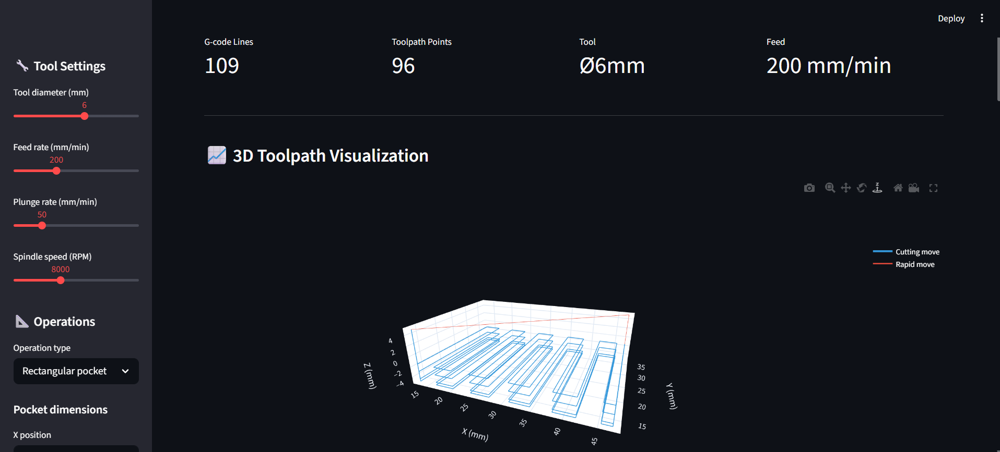
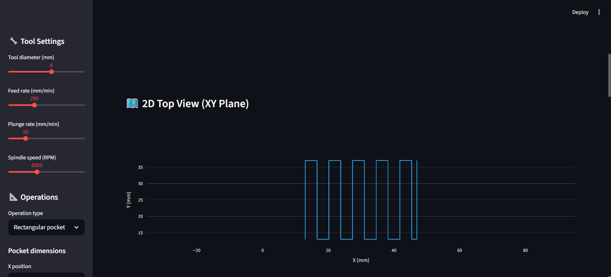
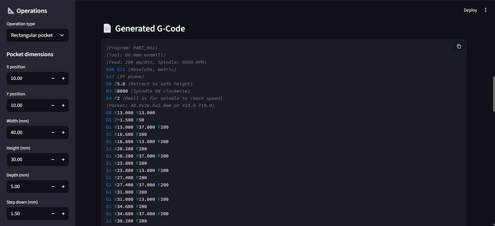

# CNC G-Code Generator & Toolpath Visualizer
 **3D Toolpath Visualization**

**2D Top view**

**Generated G-Code**

 
## Overview
Generates real CNC G-code from user-defined geometry. 3D
toolpath visualization shows cutting and rapid moves.
Supports rectangular pockets, circular pockets, and hole patterns.
 
## Live Demo
**[Open Generator](https://cnc-gcode-generator-hv9wqptrakxsv6nbv4mlx8.streamlit.app/)**
 
## Features
- 4 operation types: rect pocket, circular pocket, bolt circle, combined
- Adjustable: tool diameter, feed/plunge rate, spindle speed
- 3D toolpath visualization (cutting=blue, rapid=red)
- 2D top view of toolpath
- Downloadable .nc G-code file
- Real G-code: G0, G1, G90, G21, M3, M5, M30
 
 ## Author
**Oscar Vincent Dbritto**
